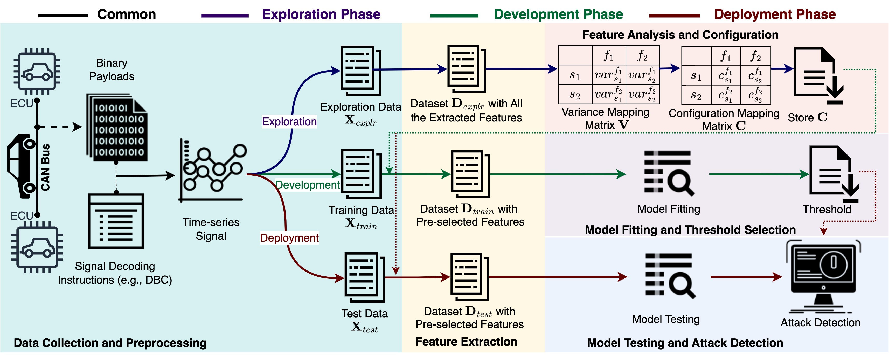

# cantropy
CANtropy: Time Series Feature Extraction-Based Intrusion Detection Systems for Controller Area Networks

This repository provides the python implementation of CANtropy, a manual feature engineering-based lightweight CAN IDS. For each signal, CANtropy explores a comprehensive set of features from both temporal and statistical domains and selects only the effective subset of features in the detection pipeline to ensure scalability. Later, CANtropy uses a lightweight unsupervised anomaly detection model based on principal component analysis, to learn the mutual dependencies of the features and detect abnormal patterns in the sequence of CAN messages. The evaluation results on the advanced SynCAN dataset show that CANtropy provides a comprehensive defense against diverse types of cyberattacks.




## Clone cantropy

```
git clone https://github.com/shahriar0651/cantropy.git
cd cantropy
```

## Install Mambaforge
### Download and Install Mambaforge
```
wget https://github.com/conda-forge/miniforge/releases/latest/download/Mambaforge-$(uname)-$(uname -m).sh
chmod +x Mambaforge-$(uname)-$(uname -m).sh
./Mambaforge-$(uname)-$(uname -m).sh
```
### Create Environment
```
mamba env create --file dependency/environment.yaml
```
Or update the existing env
```
mamba env update --file dependency/environment.yaml --prune
```

### Activate Environment
```
mamba activate cantropy
```

## Download Dataset

### Download SynCAN Dataset

```
cd src
chmod +x download_syncan_dataset.sh
./download_syncan_dataset.sh
```

Here is the tree file structure after downloading the synCAN dataset:
```
datasets/
└── can-ids/
    └── syncan
        ├── ambients
        │   ├── train_1.csv
        │   ├── train_2.csv
        │   ├── train_3.csv
        │   └── train_4.csv
        ├── attacks
        │   ├── test_continuous.csv
        │   ├── test_flooding.csv
        │   ├── test_plateau.csv
        │   ├── test_playback.csv
        │   └── test_suppress.csv
        ├── License terms.txt
        └── README.md
```

## Implementing cantropy

### Feature Extraction
```
python run_feature_extraction.py -m data_type=training,testing
```

### Feature Analysis and Evaluation
```
python run_feature_analysis.py
```

## Unit Test
- To run the scripts on a smaller fraction of dataset add the argument ```dataset_fraction=<any fraction within 0.0 to 1.0>```
- For instance, to run the scripts on the first 10% of the data points (both training and testing):
  
  ```python
  python run_feature_extraction.py -m data_type=training,testing dataset_fraction=0.10
  python run_feature_analysis.py dataset_fraction=0.10
  ```
  
## Visualization and Results

- The figures are saved in `artificts/figures` folder.
- The results are saved in `artificts/results` folder.

## Citation
```bibtex
@inproceedings{shahriar2023cantropy,
  title={CANtropy: Time series feature extraction-based intrusion detection systems for controller area networks},
  author={Shahriar, Md Hasan and Lou, Wenjing and Hou, Y Thomas},
  booktitle={Proceedings of Symposium on Vehicles Security and Privacy (VehicleSec)},
  pages={1--8},
  year={2023},
  doi={https://dx.doi.org/10.14722/vehiclesec.2023.23090}
}
```
